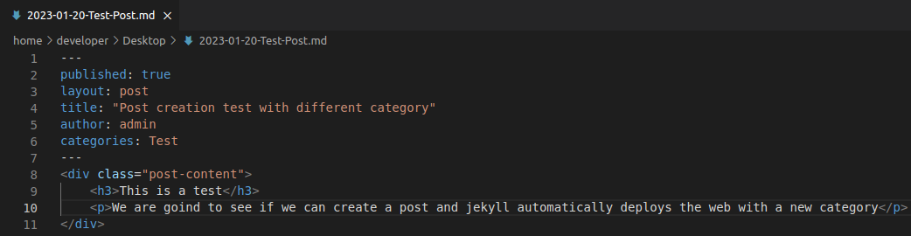
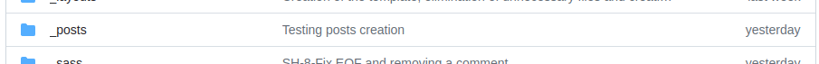
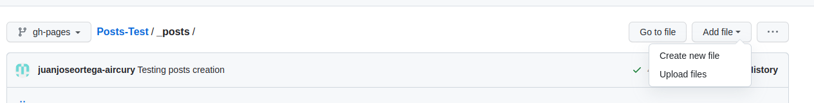
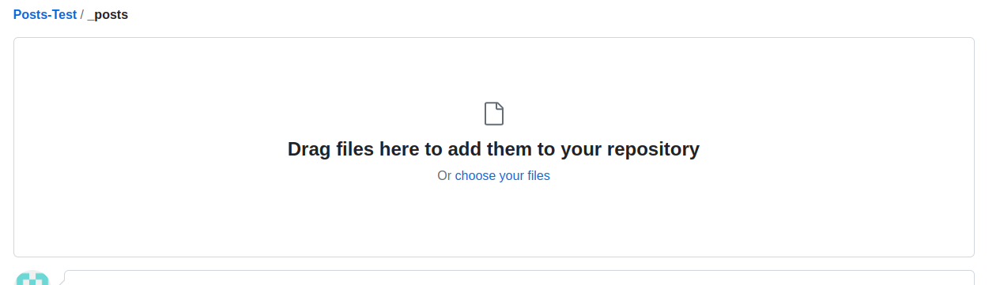
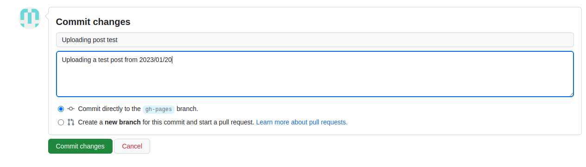

Posts Creation

If you want to create a post you should create a file in _posts, the file name structure need to be YYYY-MM-DD-name-of-the-post.md)

This is what  we need to add to our new post:

    1.- published: true (or “false” if you don’t want this post to be published)

    2.- layout: post

    3.- title: “Title” (The title u want to be shown in your post)

    4.- author: name (name of the author to be shown )

    5.- categories: name (name for categories to be created and shown in the sidebar)
    

Then, you make a div with the class “post-content” and then  you make the html that you want.

For creating posts you don’t need to have cloned the repository locally, you can create the file like above.

After that you should upload it into the repository in the folder _posts.

    1.- Go into _posts

    2.- Then click in “Add file”, and now into “Upload File”,

    3.- Now you can drag all the posts you want to upload or choose them.

    4.- After that, you need to add a commit and now click into “Commit changes”, after committing it into the main branch (in this case gh-pages) you should wait to github pages deploy the new post
    SembaHome

